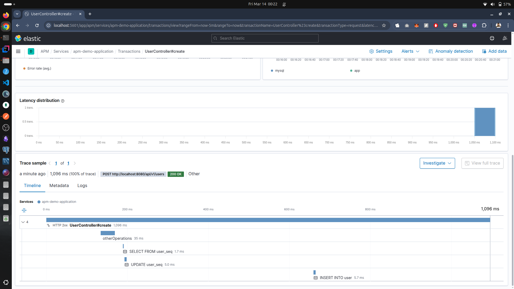

```shell
    chmod +x start.sh
```

cd docker
and run
docker compose up 

run the script for normal run of application other wise setup vm options as per below pics
./start.sh


```shell

mvn package -Dmaven.test.skip && java -javaagent:src/main/resources/elastic-apm-agent-1.51.0.jar \
-Delastic.apm.service_name=apm-demo-application \
-Delastic.apm.server_urls=http://localhost:8200 \
-Delastic.apm.secret_token= \
-Delastic.apm.environment=development \
-Delastic.apm.application_packages=com.cosmin.tutorials.apm \
-Delastic.apm.config_file=src/main/resources/apm-config.properties \
-jar target/apm-0.0.1-SNAPSHOT.jar

```


### Urls
Kibana : http://localhost:5601/

if asked
username :  elastic
passowrd : changeme

APM server : http://localhost:8200/

Elastic Search : http://localhost:9200/


###
For Running Debug Mode and starting via intellij debug
open configuration > modify options > Add VM arguments 





Ref : https://www.arika.dev/posts/how-to-deploy-elk-stack-using-docker-compose/